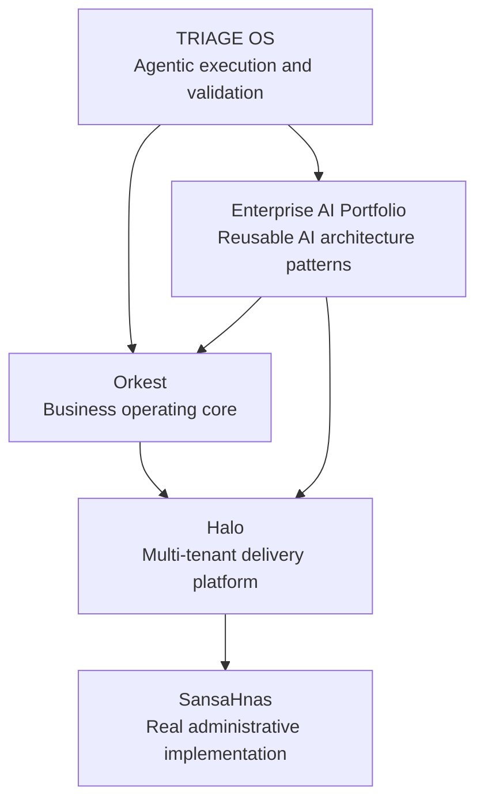

# Start Here — Enterprise AI & LLM Portfolio

## Building AI-Powered Operating Systems for Real Business Work

This portfolio is not a collection of prompt experiments.

It is a public map of the systems, patterns, and architecture decisions behind my work in AI-driven business operations.

The central idea is simple:

> Companies do not need isolated AI demos. They need operational systems that combine data, workflows, governance, automation, and human control.

## The Problem I Keep Seeing

Across enterprise technology, operations, government, energy, logistics, finance, and service businesses, the same problems appear repeatedly:

- fragmented systems;
- disconnected data;
- repetitive manual coordination;
- slow decision cycles;
- weak operational visibility;
- limited automation governance;
- AI pilots that do not become production systems.

## What I Am Building

I am building and documenting a family of systems around one thesis:

> AI becomes valuable when it is embedded into governed, observable, business-critical workflows.

## Ecosystem Map

## How the Pieces Connect

### TRIAGE OS

Agentic operating model for routing work to specialist agents, validating claims against evidence, learning from failures, and improving execution quality.

### Orkest

Agentic transactional core for business operations: modules, workers, queues, auditability, operational state, and AI-assisted workflows.

### Halo

Multi-tenant white-label platform for service businesses, with runtime governance, observability, tenant isolation, and reusable delivery standards.

### SansaHnas

Real administrative and financial platform for property, tenant, income, and expense management.

### Enterprise AI Portfolio

Public collection of AI system patterns: RAG, agentic workflows, document intelligence, monitoring, guardrails, and LLM routing.

## Why This Matters

A recruiter can evaluate technical breadth.

An investor can evaluate product thinking.

A technical founder can evaluate architecture discipline.

A business operator can evaluate whether the work is connected to real operational pain.

## Operating Principles

- Evidence over assumptions.
- Governance before scale.
- Human approval where risk is high.
- Observability before automation at scale.
- Multi-tenant foundations instead of one-off client projects.
- Business value before technical novelty.

## Evaluation Signals

This portfolio is designed to demonstrate:

- enterprise architecture thinking;
- AI systems design;
- RAG and retrieval patterns;
- agentic workflows;
- governance and risk awareness;
- multi-tenant product thinking;
- operational automation;
- practical execution over theory.
